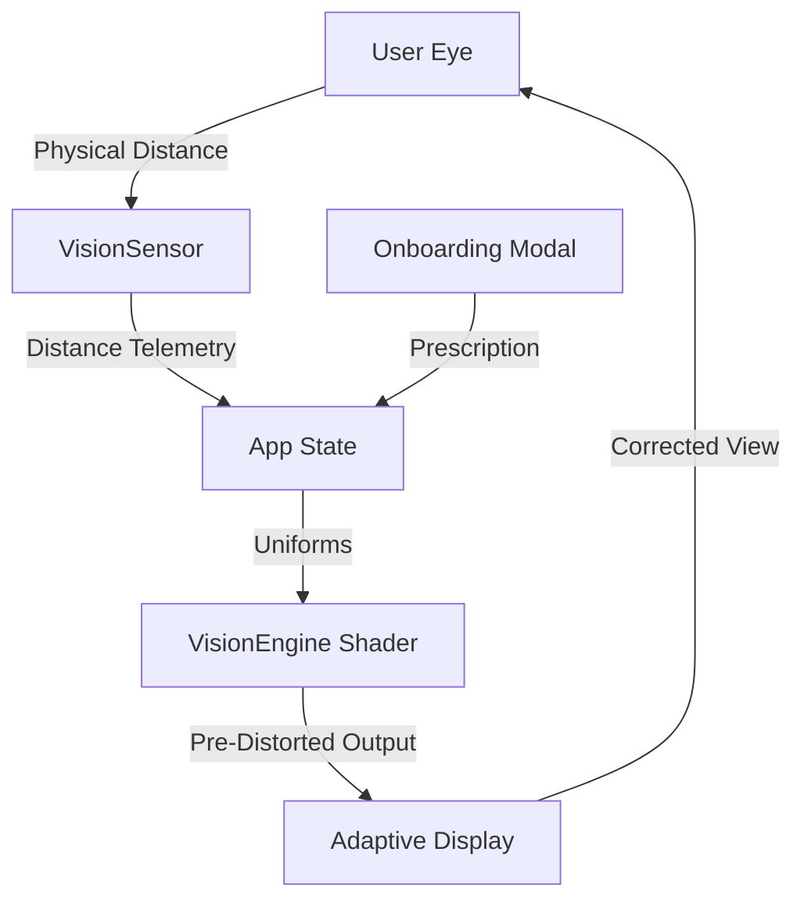

# 👁️ EYEP // Adaptive Neural Vision Platform


> **"Correcting vision, one pixel at a time."**  
> EYEP is a high-fidelity assistive display portal designed to counteract refractive errors through real-time, GPU-accelerated pixel manipulation. By synchronizing neural distance sensing with adaptive optical algorithms, EYEP provides a clear visual experience for users with SPH, CYL, and AXIS vision impairments—without the need for corrective lenses.

---

## ⚡ Core Technology

### 🧠 Neural Distance Sensing
Integrated **MediaPipe & TensorFlow.js** engine that tracks Interpupillary Distance (IPD) in real-time. The system calculates the user's physical distance from the display with millimeter precision, allowing the vision engine to adapt its correction strength dynamically.

### 🎨 Adaptive Pre-Distortion Engine
A custom **GLSL Shader pipeline** built on Three.js that performs inverse point-spread function (PSF) calculations.
- **Sphere/Cylinder/Axis Correction**: Counteracts astigmatism and refractive blur.
- **Luminance-Safe Sharpening**: Enhances edge clarity without distorting image colors or gradients.
- **Calibration Simulation**: An interactive mode that allows users to "tune" the display to their exact prescription.

### 🛠️ Cyber-SOC Dashboard
A professional, midnight-themed command center featuring:
- **Real-time Telemetry**: Distance tracking, system latency, and transmission buffers.
- **Prescription Calibration**: High-precision sliders for SPH, CYL, AXIS, and Add Power.
- **Onboarding Pipeline**: A multi-stage calibration modal to initialize user profiles.

---

## 🚀 Getting Started

### Prerequisites
- Node.js (v18+)
- A modern webcam (for Neural Sensing)

### Installation
1. **Clone the repository**
   ```bash
   git clone https://github.com/bharathkumar000/dsu.git
   cd eyep
   ```

2. **Install dependencies**
   ```bash
   npm install
   ```

3. **Start the Neural Engine**
   ```bash
   npm run dev
   ```

4. **Access the Portal**
   Open [http://localhost:3000](http://localhost:3000) in your browser.

---

## 🏗️ Architecture



## 📜 Project Roadmap

- [x] **Phase 1**: Real-time GLSL Blur/Sharp Simulation
- [x] **Phase 2**: MediaPipe Neural Distance Integration
- [x] **Phase 3**: Multi-layered Prescription Calibration
- [ ] **Phase 4**: Per-eye Independent Correction Viewport
- [ ] **Phase 5**: Hardware Integration with Variable Focus Lenses

---

## 🏆 Hackathon Notes
EYEP was built with a "Privacy-First" approach. All Neural Sensing data is processed **locally in the browser** using WebGL—no facial data ever leaves the client device.

**Team:** [Bharath Kumar](https://github.com/bharathkumar000) & Team  
**Tech:** React, Three.js, MediaPipe, TailwindCSS, Supabase.

---

<p align="center">
  
  
  
</p>
