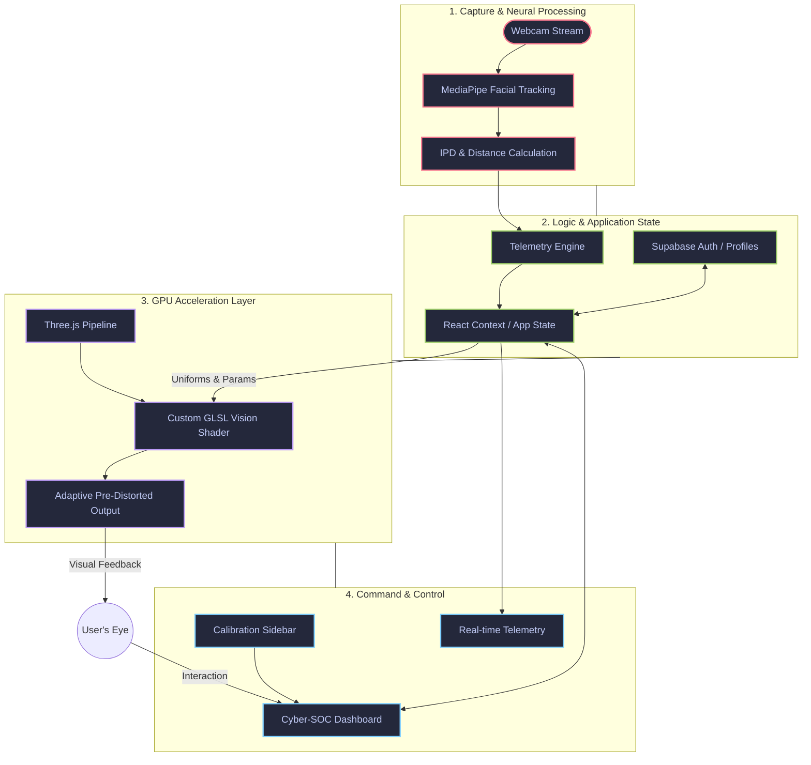

# 👁️ EYEP // System Architecture

This document outlines the high-level technical architecture and data flow of the **EYEP Adaptive Neural Vision Platform**. The system is designed to provide real-time vision correction through a combination of neural sensing and GPU-accelerated optical simulation.

---

## 🏗️ Technical Flowchart

---

## 🚀 Architectural Layers

### 1. Capture & Neural Processing Layer
The front-line of the system. It utilizes the device's camera to capture facial landmarks.
- **MediaPipe Face Mesh**: Detects 468+ facial landmarks in real-time.
- **IPD Sensing**: Calculates the Interpupillary Distance and converts pixel-distance to real-world millimeters using focal length constants.
- **Privacy First**: All processing occurs locally in the browser; no video frames are ever transmitted to a server.

### 2. Logic & Application State Layer
The "Brain" of the application that synchronizes sensor data with user settings.
- **React Context**: Manages the global state for prescription parameters (SPH, CYL, AXIS).
- **Telemetry Engine**: Filters and smooths distance data to prevent jitter in the vision correction.
- **Supabase Integration**: Persists user profiles and calibration data for seamless cross-session experiences.

### 3. GPU Acceleration Layer (The VisionEngine)
The core correction mechanism that performs inverse optical distortion.
- **Three.js**: Manages the 3D scene and texture mapping.
- **GLSL Shaders**: A custom shader pipeline that applies point-spread function (PSF) corrections based on the user's specific refractive error.
- **Dynamic Uniforms**: The shader is updated every frame with fresh distance data, adjusting the "focal point" of the pre-distortion dynamically.

### 4. Command & Control Layer (Cyber-SOC)
A professional dashboard for real-time monitoring and calibration.
- **Calibration Sidebar**: High-precision sliders for sub-millimeter vision adjustments.
- **Real-time Telemetry**: Visualizes system performance, distance metrics, and neural engine confidence.
- **Adaptive UI**: Responds to system alerts (e.g., "User too close" or "Low light detection").

---

## 🛠️ Technology Stack

| Layer | Technologies |
| :--- | :--- |
| **Frontend** | React 18, TailwindCSS, Framer Motion |
| **Neural Sensing** | MediaPipe, TensorFlow.js |
| **Optics Engine** | Three.js, GLSL (WebGL 2.0) |
| **Backend** | Supabase (PostgreSQL, Auth) |
| **Build Tooling** | Vite, PostCSS |

---

*Last Updated: April 2026*
